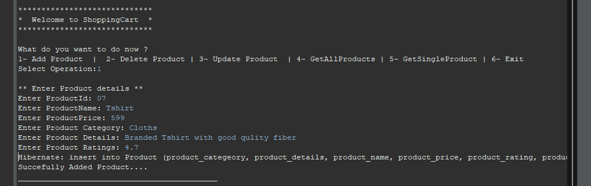
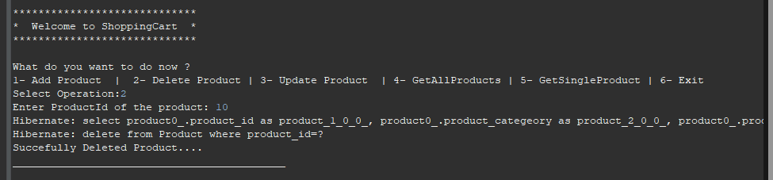
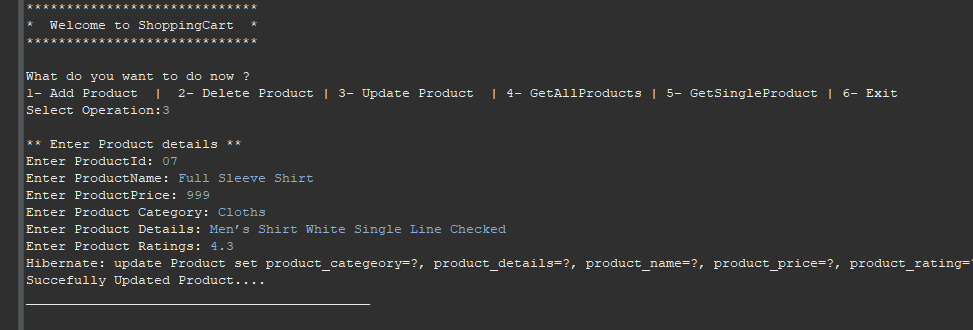
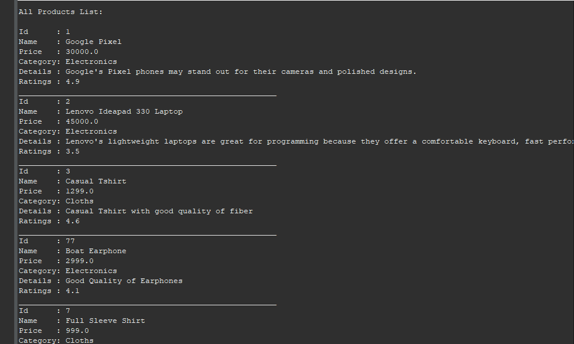
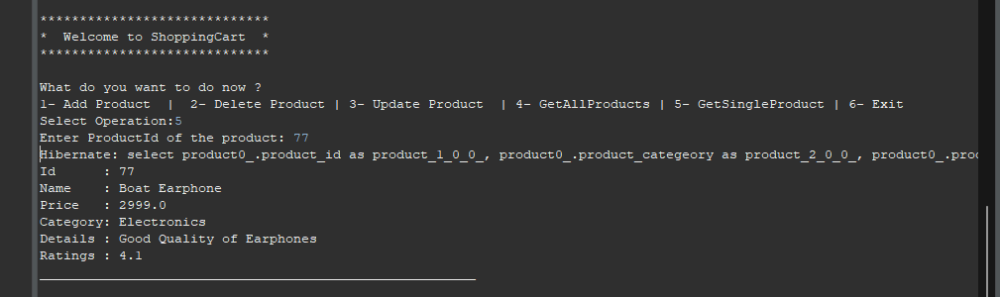
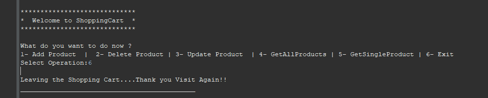

# Product Cart - Console Application

This is a console-based application developed using Spring Framework with Spring ORM. It allows users to manage a product cart, including adding products, deleting products, updating products, and viewing products in the cart.

## Features

- Add products to the cart
- Delete products from the cart
- Update products from the cart
- View All products from the cart
- View Single Product from the cart

## Technologies Used

- Java
- Spring Framework
- Spring ORM (Object-Relational Mapping)
- Maven
- MySQL Database

## Usage

1. Upon running the application, you will be presented with a menu to choose from various options.
2. Use the menu options to add products to the cart, delete products, update products , view single or all products.
3. Follow the on-screen instructions to perform the desired actions.

## Screenshots

### Adding Product

### Deleting Product

### Updating Product

### Viewing All Products

### Viewing Single Product

### Exit Application

